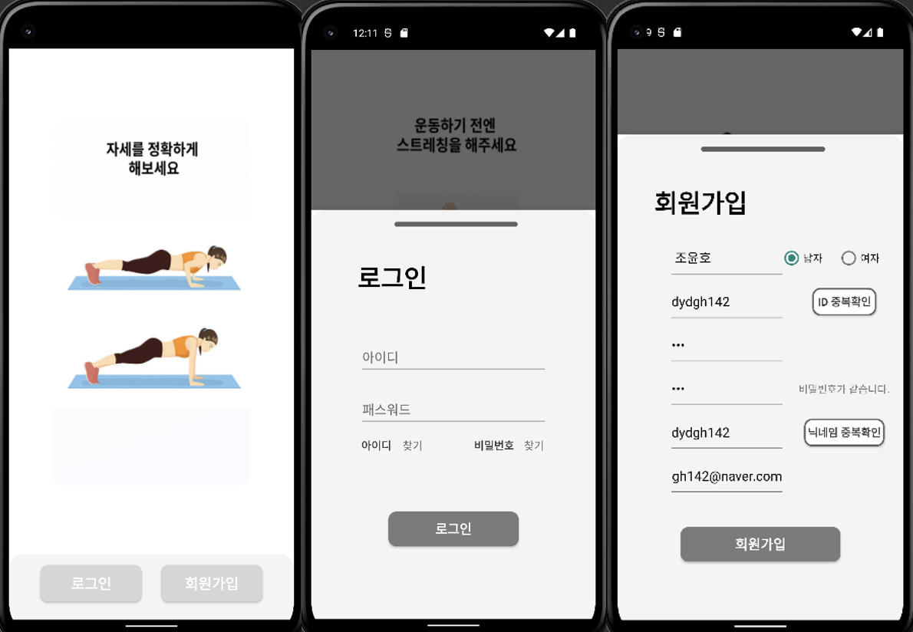
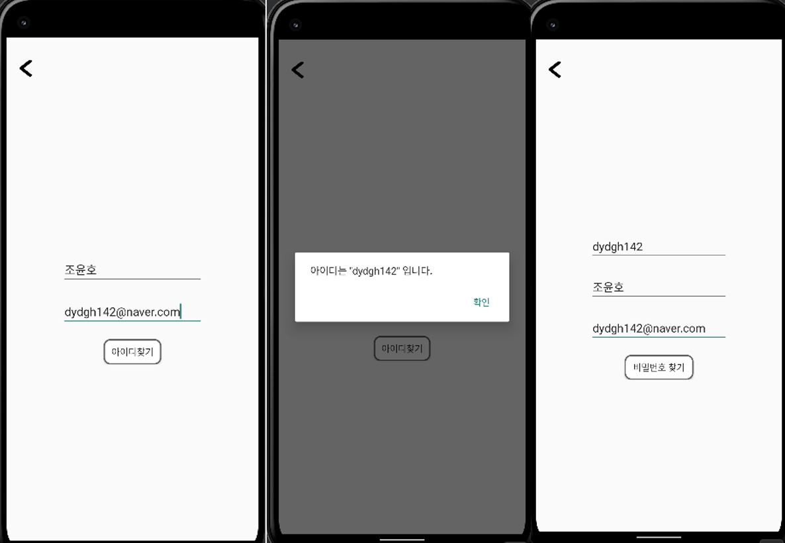
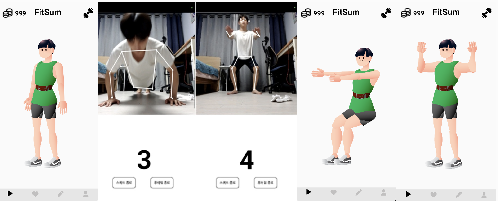
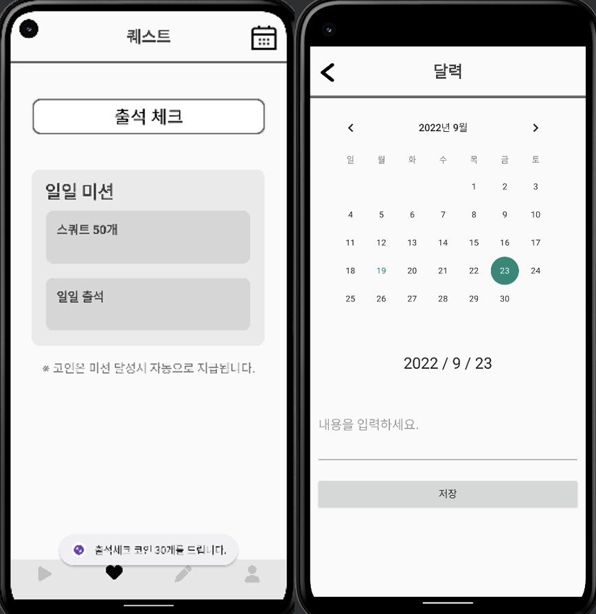
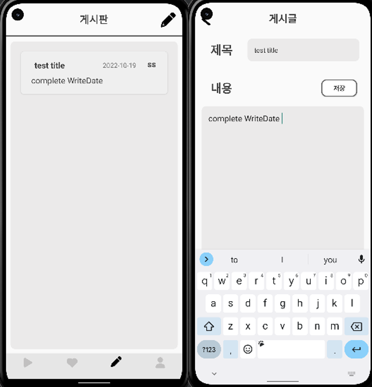
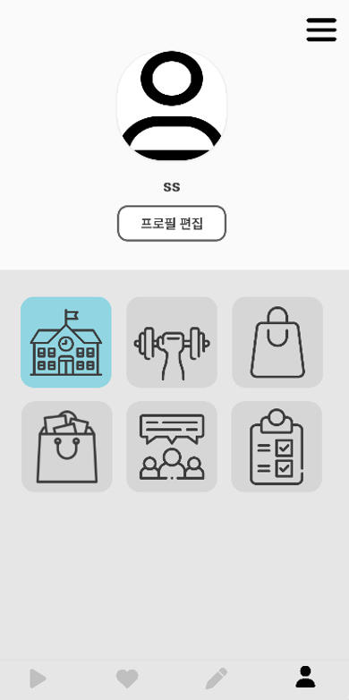

# FitSum
 

> 2022 Anyang Univ. Capston Design Contest 🎖️
 

'FitSum'은 Tensorflow의 Posenet을 이용하여 사용자의 자세를 인식해 올바른 운동 자세를 갖게 하고, 꾸준한 동기부여 환경을 제공해주는 게임형 운동 어플이다. 
 
 
## PoseNet

- PoseNet은 주요 신체 관절의 위치를 예측하여 이미지 또는 비디오에서 사람의 포즈를 예측하는 데 사용할 수 있는 비전 모델이다.
- PoseNet을 사용하여 사용자의 운동 자세를 인식하고 운동마다 지정된 관절의 각도, 위치를 이용해 올바른 운동습관을 들이도록 한다.
- PoseNet은 동시에 여러사람의 관절을 포착할 수 있기 때문에 운동하는 사용자를 찾아 한 인물의 자세만 예측할 수 있도록 한다.
   

## 개발목표 3가지
- 사용자의 운동을 도와주는 어플이므로 정확한 자세를 수행시 카운트가 되도록 하는 운동 어플을 만든다.
- 집에서 하는 운동이므로 다양한 운동기구가 필요하지 않은 운동을 주가 되도록 한다.
- 사용자의 운동을 지속되게 하도록 동기부여 환경을 다양하게 부여한다.
   

---
## Result

### FirstPage - 로그인, 회원가입

 

 

### Find Password, ID - 아이디찾기, 비밀번호 찾기

 

 

### MainPage - 메인화면 및 운동화면

 

 

### QuestPage - 퀘스트화면 

 

 

### BoardPage - 게시판화면 

 

 

### ProfilePage - 프로필화면 

 

 

---

### References
- [Tenserflow.Posenet](https://www.tensorflow.org/lite/examples/pose_estimation/overview)

   
**Thank you**

